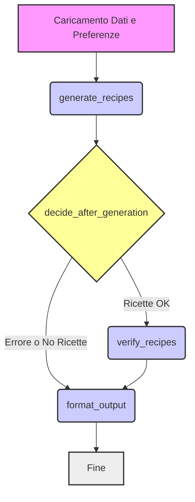

# NutriCHOice - Generatore Ricette CHO (Generate then Fix)

## 📋 Panoramica

Questo progetto implementa un sistema di generazione di ricette personalizzate basato su LLM, focalizzato sull'approccio **"Generate then Fix"**. L'obiettivo è creare ricette che rispettino un target specifico di carboidrati (CHO) e preferenze dietetiche (vegano, vegetariano, senza glutine, senza lattosio).

Il sistema utilizza un'architettura basata su agenti orchestrati da **LangGraph**. Un agente generatore crea ricette iniziali in modo creativo, mentre un agente verificatore potenziato analizza, corregge, ottimizza e filtra queste ricette per garantire la conformità ai requisiti e la qualità finale.

## 🎯 Obiettivo del progetto

Generare ricette gustose, realistiche e personalizzate che soddisfino:

- Un **target specifico di carboidrati (CHO)**.
- **Preferenze dietetiche** definite dall'utente.
- Requisiti di **qualità e diversità** tra le opzioni proposte.

## 🏗️ Architettura del sistema: Approccio "Generate then Fix"

Il sistema adotta un approccio "Generate then Fix":

1.  **Generate:** L'LLM genera ricette in modo creativo, con vincoli minimi sul calcolo preciso dei nutrienti ma rispettando le linee guida generali (formato, ingredienti comuni, preferenze dietetiche).
2.  **Fix (Verify & Optimize):** Un agente specializzato (Verifier Agent) analizza le ricette generate. Effettua:
    - **Matching degli ingredienti:** Collega gli ingredienti generati dall'LLM al database interno utilizzando FAISS e Sentence Transformers per l'analisi semantica.
    - **Calcolo nutrizionale:** Calcola CHO, calorie, etc., basandosi sui dati del database.
    - **Verifica dietetica:** Controlla e corregge i flag dietetici (vegan, gluten-free, etc.) basandosi sugli ingredienti effettivi.
    - **Ottimizzazione CHO:** Modifica le quantità degli ingredienti (proporzionalmente o in modo mirato) per avvicinare il contenuto di CHO al target desiderato.
    - **Verifica di qualità e diversità:** Scarta ricette incomplete, troppo semplici o troppo simili ad altre già selezionate.

### Flusso di lavoro LangGraph

Il grafo implementa questo flusso, gestendo errori e assicurando che solo ricette valide e ottimizzate raggiungano l'output finale.

## 📊 Modelli di dati (model_schema.py)

Il sistema si basa su modelli Pydantic per una strutturazione robusta dei dati:

`UserPreferences`: Input dell'utente (target CHO, flag dietetici).
`IngredientInfo`: Dati nutrizionali e flag dietetici per singolo ingrediente dal DB.
`RecipeIngredient`: Rappresenta un ingrediente con quantità (usato internamente per calcoli).
`CalculatedIngredient`: Estende `RecipeIngredient` includendo i contributi nutrizionali calcolati e flag dietetici verificati. Contiene anche original_llm_name.
`FinalRecipeOption`: La struttura completa di una ricetta finale, validata e ottimizzata, pronta per l'utente. Include una lista di `CalculatedIngredient`.
`GraphState`: TypedDict che rappresenta lo stato condiviso tra i nodi del grafo LangGraph (include preferenze, dati, modelli, ricette intermedie/finali, errori).

## 🧠 Agenti e loro funzioni

1. **Generator Agent (generator_agent.py)** - Semplificato
   **Responsabilità:** Generare bozze creative di ricette basate sulle preferenze generali e sul target CHO approssimativo, senza effettuare calcoli precisi o matching ingredienti.
   **Input:** UserPreferences, target_cho, dietary_preferences_string.
   **Output:** Lista di FinalRecipeOption non verificate (con total_cho e altri nutrienti a None, ingredienti come `CalculatedIngredient` ma con solo name = original_llm_name e quantity_g).
   **Tecnologia:** ChatOpenAI (gpt-3.5-turbo o simili), Langchain Expression Language (LCEL).

2. **Verifier Agent** (verifier_agent.py) - Potenziato
   **Responsabilità**: Il "cervello" del sistema. Analizza, valida, ottimizza e filtra le ricette generate.
   **Input**: Lista di FinalRecipeOption non verificate, UserPreferences, database ingredienti, modello SBERT, indice FAISS.
   **Output**: Lista di FinalRecipeOption verificate e ottimizzate.
   Funzioni Chiave:

   - match_recipe_ingredients: Utilizza FAISS e Sentence Transformers per mappare gli ingredienti LLM al DB. Aggiorna gli ingredienti nella ricetta e calcola i nutrienti.
   - calculate_ingredient_cho_contribution: Funzione di utilità per calcolare i nutrienti.
   - compute_dietary_flags: Verifica e imposta i flag dietetici basandosi sugli ingredienti matchati.
   - optimize_recipe_cho: Applica strategie (scaling proporzionale, aggiustamento fine) per raggiungere il target CHO.
   - suggest_cho_adjustment / add_ingredient: Eventuali modifiche più drastiche (aggiunta/modifica ingredienti) se l'ottimizzazione standard fallisce.
   - ensure_recipe_diversity: Filtra ricette troppo simili tra loro usando calculate_recipe_similarity.
   - Verifiche finali su range CHO, numero ingredienti/istruzioni.

## 🛠️ Setup e Dipendenze Chiave

- Python 3.10+
- Langchain (langchain, langchain-openai, langgraph)
- Sentence Transformers (sentence-transformers)
- FAISS (faiss-cpu o faiss-gpu)
- Pandas (pandas) per il caricamento dati
- NumPy (numpy)
- Pydantic (pydantic) per la validazione dei dati
- Streamlit (streamlit) per l'interfaccia web (opzionale, in app.py)
- python-dotenv per la gestione delle API keys

## Preparazione Dati:

Prima di eseguire il sistema, è necessario creare l'indice FAISS e il mapping dei nomi degli ingredienti:

`python create_faiss_index.py`

Questo script legge data/ingredients.csv, genera gli embedding e salva data/ingredients.index e data/ingredient_names.pkl. Assicurati che data/ingredients.csv esista e sia formattato correttamente.

## API Key:

È necessaria una API key di OpenAI. Impostarla come variabile d'ambiente OPENAI_API_KEY (ad esempio in un file .env).

## 🚀 Utilizzo

Esecuzione da linea di comando

`python main.py <target_cho> [--vegan] [--vegetarian] [--gluten_free] [--lactose_free]`

Esempio: Generare ricette vegetariane con circa 100g di CHO.

`python main.py 100 --vegetarian`

Esecuzione con Streamlit (Interfaccia Web)
`streamlit run app.py`

Questo avvierà un server web locale con un'interfaccia utente per inserire le preferenze e visualizzare i risultati.

## 🔍 Dettagli Tecnici Chiave

- Matching Ingredienti: utils.find_best_match_faiss utilizza Sentence Transformers per creare embedding vettoriali dei nomi degli ingredienti (sia dal LLM che dal DB) e FAISS per trovare la corrispondenza più vicina nello spazio vettoriale.
- Calcolo Nutrienti: utils.calculate_ingredient_cho_contribution calcola i contributi basandosi sui dati del DB per gli ingredienti matchati. Gestisce ingredienti non trovati o senza dati.
- Ottimizzazione CHO: verifier_agent.optimize_recipe_cho implementa logiche di scaling proporzionale e aggiustamento fine basate sulla differenza tra CHO attuale e target.
- Gestione Stato: GraphState (TypedDict) mantiene lo stato condiviso, permettendo ai nodi di accedere e modificare dati come le preferenze, le ricette generate/verificate e i messaggi di errore.
  💡 Punti di forza dell'approccio "Generate then Fix"
- Creatività LLM: Sfrutta la capacità dell'LLM di generare idee originali senza sovraccaricarlo con calcoli precisi.
- Accuratezza del Verificatore: Garantisce la conformità ai requisiti numerici e dietetici tramite logica Python e dati certi.
- Robustezza: Separa la generazione dalla verifica, rendendo il sistema meno suscettibile a errori di calcolo dell'LLM.
- Flessibilità: L'agente verificatore può implementare logiche di ottimizzazione complesse.

## 🔄 Flusso di elaborazione dettagliato

1. L'utente specifica target CHO e preferenze (UserPreferences).
2. `main.py` o `app.py` caricano risorse (modello SBERT, indice FAISS, dati ingredienti) e preparano GraphState iniziale.
3. `generate_recipes_agent`: Genera N bozze di ricette creative (List[FinalRecipeOption] non verificate).
4. `decide_after_generation`: Controlla se ci sono ricette e instrada al verificatore o direttamente al formatter.
5. verifier_agent:

- Per ogni ricetta:
  - Matcha ingredienti (find_best_match_faiss).
  - Calcola nutrienti (calculate_ingredient_cho_contribution).
  - Verifica/corregge flag dietetici (compute_dietary_flags).
  - Verifica preferenze utente.
- Filtra ricette non matchate o non conformi.
- Per le ricette rimanenti:
  - Ottimizza CHO (optimize_recipe_cho, suggest_cho_adjustment).
- Filtra ricette non ottimizzabili o fuori range finale.
- Verifica diversità (ensure_recipe_diversity).
- Seleziona le migliori N ricette (final_verified_recipes).

6. `formatter_agent`: Prende final_verified_recipes e error_message, genera la stringa HTML final_output.
7. L'output HTML viene presentato all'utente (console o Streamlit).
