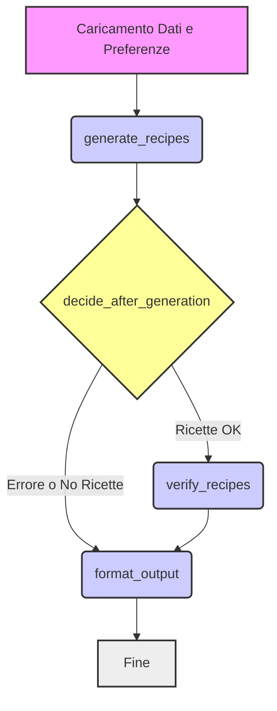

# NutriCHOice - Generatore Ricette CHO (Generate then Fix)

NutriCHOice è un assistente culinario intelligente che utilizza l'approccio innovativo **"Genera e Correggi"** per creare ricette personalizzate che rispettano i tuoi obiettivi nutrizionali.

**Sviluppato come progetto finale del Bootcamp AI di Edgemony** 🎓

## Team `Import error: Domenico Not Found`

- Veronica Schembri
- Francesca Ballirò
- Valentina Bellezza
- Giulia Gambuzza

## 📋 Panoramica

Questo progetto implementa un sistema di generazione di ricette personalizzate basato su LLM, focalizzato sull'approccio **"Generate then Fix"**. L'obiettivo è creare ricette che rispettino un target specifico di carboidrati (CHO) e preferenze dietetiche (vegano, vegetariano, senza glutine, senza lattosio).

Il sistema utilizza un'architettura basata su agenti orchestrati da **LangGraph**. Un agente generatore crea ricette iniziali in modo creativo, mentre un agente verificatore potenziato analizza, corregge, ottimizza e filtra queste ricette per garantire la conformità ai requisiti e la qualità finale.

## 🎯 Obiettivo del progetto

Generare ricette gustose, realistiche e personalizzate che soddisfino:

- Un **target specifico di carboidrati (CHO)**.
- **Preferenze dietetiche** definite dall'utente.
- Requisiti di **qualità e diversità** tra le opzioni proposte.

## 🏗️ Architettura del sistema: Approccio "Generate then Fix"

Il sistema adotta un approccio "Generate then Fix":

1.  **Generate:** L'LLM genera ricette in modo creativo, con vincoli minimi sul calcolo preciso dei nutrienti ma rispettando le linee guida generali (formato, ingredienti comuni, preferenze dietetiche).
2.  **Fix (Verify & Optimize):** Un agente specializzato (Verifier Agent) analizza le ricette generate. Effettua:
    - **Matching semantico avanzato degli ingredienti:** Collega gli ingredienti generati dall'LLM al database interno utilizzando FAISS e Sentence Transformers con strategie multi-livello e fallback per aumentare la robustezza.
    - **Calcolo nutrizionale preciso:** Calcola CHO, calorie, proteine, grassi e fibre basandosi sui dati del database.
    - **Verifica dietetica intelligente:** Controlla e corregge i flag dietetici (vegan, gluten-free, etc.) basandosi sugli ingredienti effettivi attraverso regole specifiche di dominio.
    - **Ottimizzazione CHO multi-strategia:** Implementa diverse strategie di ottimizzazione modulari che modificano le quantità degli ingredienti in modo selettivo e intelligente per avvicinare il contenuto di CHO al target desiderato.
    - **Verifica di qualità e diversità:** Scarta ricette incomplete, troppo semplici o troppo simili ad altre già selezionate utilizzando metriche di somiglianza multi-criterio.

### Flusso di lavoro LangGraph



Il grafo implementa questo flusso, gestendo errori e assicurando che solo ricette valide e ottimizzate raggiungano l'output finale.

## 📊 Modelli di dati (model_schema.py)

Il sistema si basa su modelli Pydantic per una strutturazione robusta dei dati:

- `UserPreferences`: Input dell'utente (target CHO, flag dietetici).
- `IngredientInfo`: Dati nutrizionali e flag dietetici per singolo ingrediente dal DB.
- `RecipeIngredient`: Rappresenta un ingrediente con quantità (usato internamente per calcoli).
- `CalculatedIngredient`: Estende `RecipeIngredient` includendo i contributi nutrizionali calcolati e flag dietetici verificati. Contiene anche original_llm_name per tracciabilità.
- `FinalRecipeOption`: La struttura completa di una ricetta finale, validata e ottimizzata, pronta per l'utente. Include una lista di `CalculatedIngredient`.
- `GraphState`: TypedDict che rappresenta lo stato condiviso tra i nodi del grafo LangGraph (include preferenze, dati, modelli, ricette intermedie/finali, errori).

## 🧠 Agenti e loro funzioni

1. **Generator Agent (generator_agent.py)** - Semplificato

   - **Responsabilità:** Generare bozze creative di ricette basate sulle preferenze generali e sul target CHO approssimativo.
   - **Input:** UserPreferences, target_cho, dietary_preferences_string.
   - **Output:** Lista di FinalRecipeOption non verificate (con total_cho e altri nutrienti a None).
   - **Tecnologia:** ChatOpenAI (gpt-3.5-turbo), Langchain Expression Language (LCEL).
   - **Caratteristiche principali:**
     - Utilizzo di ThreadPoolExecutor per generazione parallela di ricette
     - Gestione robusta di estrazione JSON con metodi di fallback
     - Retry in caso di errori API o parsing
     - Conversione strutturata delle ricette generate in oggetti Pydantic

2. **Verifier Agent (verifier_agent.py)** - Potenziato e Refactorizzato

   - **Responsabilità**: Il "cervello" del sistema. Analizza, valida, ottimizza e filtra le ricette generate.
   - **Input**: Lista di FinalRecipeOption non verificate, UserPreferences, database ingredienti, modello SBERT, indice FAISS.
   - **Output**: Lista di FinalRecipeOption verificate e ottimizzate.
   - **Nuove Classi**:
     - `OptimizationStrategy`: Enum che definisce formalmente le strategie di ottimizzazione disponibili (SINGLE_INGREDIENT, PROPORTIONAL, CASCADE, HYBRID)
     - `OptimizationResult`: Classe che incapsula i risultati delle ottimizzazioni con metadati utili (successo, miglioramento, strategia usata, messaggio)
   - **Funzioni Chiave**:
     - **match_recipe_ingredients**: Sistema multi-strategia di matching con FAISS, normalizzazione, mappature e fallback.
     - **recalculate_nutrition**: Funzione centralizzata per il ricalcolo dei valori nutrizionali.
     - **update_recipe_dietary_flags**: Verifica unificata dei flag dietetici basata su ingredienti.
     - **optimize_recipe_cho**: Implementa la strategia multi-approccio per l'ottimizzazione CHO.
     - **optimize_single_ingredient, optimize_proportionally, optimize_cascade**: Strategie di ottimizzazione modulari e specializzate.
     - **adjust_ingredient_quantity**: Funzione helper per modifiche sicure alle quantità degli ingredienti.
     - **calculate_recipe_similarity**: Calcola similarità tra ricette con pesi differenziati.
     - **ensure_recipe_diversity**: Filtra ricette troppo simili basandosi su calculate_recipe_similarity.
     - **analyze_recipe_dietary_properties**: Analisi approfondita delle proprietà dietetiche basata su ingredienti.
     - **check_dietary_compatibility**: Verifica la compatibilità della ricetta con le preferenze utente.
   - **Processo di verifica in 5 fasi**:
     1. Matching ingredienti, calcolo nutrienti e verifica dietetica preliminare
     2. Ottimizzazione CHO con metodi progressivi e strategie multiple
     3. Verifica finale (qualità, realismo, range CHO stretto)
     4. Verifica diversità tra ricette
     5. Selezione finale e ordinamento

3. **Formatter Agent** (formatter_agent.py)
   - **Responsabilità**: Presentare le ricette in formato visivamente gradevole e strutturato.
   - **Input**: Lista di FinalRecipeOption verificate, errori, preferenze utente.
   - **Output**: HTML formattato per display web con gestione icone e fallback emoji.
   - **Caratteristiche**:
     - Gestione di icone per preferenze dietetiche con encoding base64
     - Display strutturato di ingredienti, nutrienti e istruzioni
     - Gestione intelligente di vari scenari di output
     - Ottimizzazioni di caching per immagini (lru_cache)

## 🔍 Dettagli Tecnici Chiave

### Embedding e Matching Semantico

Il sistema utilizza un approccio sofisticato di embedding e matching semantico per collegare gli ingredienti generati dall'LLM con quelli nel database:

1. **Preparazione Database**:

   - Gli ingredienti del database vengono normalizzati
   - Per ogni ingrediente viene generato un embedding con SentenceTransformer
   - Gli embedding vengono salvati in un indice FAISS per ricerca efficiente
   - Viene mantenuto un mapping tra indici FAISS e nomi ingredienti

2. **Matching Ingredienti Generati**:

   - Quando l'LLM genera un ingrediente, questo viene normalizzato
   - Si genera l'embedding "al volo" per l'ingrediente normalizzato
   - L'embedding viene confrontato con l'indice FAISS per trovare gli ingredienti più simili
   - Si applica una soglia di similarità per filtrare match poco affidabili
   - Si implementano strategie di fallback quando il matching diretto fallisce

3. **Mappature Bidirezionali per Massima Robustezza**:

   - Il sistema mantiene due dizionari di mapping:
     - `normalized_to_original`: mappa nomi normalizzati → nomi originali nel database
     - `original_to_normalized`: mappa nomi originali → nomi normalizzati
   - Questi mapping permettono conversioni bidirezionali tra forme normalizzate e originali
   - Consentono di recuperare il nome originale dopo il matching e di conservare le informazioni originali dal database

4. **Strategie di Matching Multi-livello**:
   - Livello 1: Match diretto con nome esatto (dopo normalizzazione)
   - Livello 2: Match tramite sinonimi comuni predefinti
   - Livello 3: Match semantico con FAISS e soglia adattiva
   - Livello 4: Match con forme singolare/plurale e varianti linguistiche
   - Livello 5: Fallback a dizionari di corrispondenze predefinite

Questo approccio permette di gestire efficacemente la variabilità linguistica e le ambiguità nella descrizione degli ingredienti, un problema critico nei sistemi di generazione ricette.

### Normalizzazione e Preprocessamento

- **Normalizzazione Linguistica**:

  - `normalize_name` in utils.py implementa la logica di normalizzazione
  - Converte tutto in minuscolo
  - Rimuove parole di colore (rosso, verde, bianco, ecc.)
  - Standardizza gli spazi e rimuove spazi in eccesso
  - Questa normalizzazione viene applicata sia agli ingredienti del database che a quelli generati dall'LLM

- **Ottimizzazione CHO Multi-strategia**:

  - Approccio modulare con strategie ben definite (OptimizationStrategy)
  - Strategia singolo-ingrediente per piccole differenze (<15g)
  - Scaling proporzionale per modifiche moderate
  - Approccio a cascata per grandi differenze
  - Selezione intelligente della migliore strategia basata sui risultati (OptimizationResult)
  - Limite di sicurezza sulle quantità degli ingredienti per mantenere ricette realistiche

- **Verifica Diversità Con Pesi**:
  - Algoritmo di calcolo similarità multi-criterio con pesi differenziati:
    - Somiglianza nel titolo (0.2)
    - Ingredienti principali condivisi (0.4)
    - Tipo di piatto basato su parole chiave (0.25)
    - Attributi dietetici comuni (0.15)

### Refactoring Orientato agli Oggetti

Il sistema ha adottato un approccio più orientato agli oggetti, in particolare per l'ottimizzazione delle ricette:

- **Modellazione del dominio**: I concetti chiave come strategie di ottimizzazione e risultati sono modellati come classi
- **Separazione delle responsabilità**: Ogni strategia di ottimizzazione è implementata in funzioni dedicate
- **Comunicazione strutturata**: I risultati delle ottimizzazioni vengono incapsulati in oggetti che includono metadati utili
- **Estensibilità**: La struttura modulare facilita l'aggiunta di nuove strategie di ottimizzazione

## 🛠️ Setup e Dipendenze Chiave

- Python 3.10+
- Langchain (langchain, langchain-openai, langgraph)
- Sentence Transformers (sentence-transformers)
- FAISS (faiss-cpu o faiss-gpu)
- Pandas (pandas) per il caricamento dati
- NumPy (numpy)
- Pydantic (pydantic) per la validazione dei dati
- Streamlit (streamlit) per l'interfaccia web (opzionale, in app.py)
- python-dotenv per la gestione delle API keys

## Preparazione Dati:

Prima di eseguire il sistema, è necessario creare l'indice FAISS e il mapping dei nomi degli ingredienti:

```
python create_faiss_index.py
```

Questo script:

1. Carica e normalizza i nomi degli ingredienti da data/ingredients.csv
2. Arricchisce il dataset con varianti linguistiche (singolare/plurale, sinonimi comuni)
3. Implementa una strategia di manipolazione linguistica per ingredienti problematici
4. Genera embeddings con SentenceTransformer (supporto per MPS su Apple Silicon)
5. Crea l'indice FAISS ottimizzato per ricerca semantica veloce (IndexFlatIP)
6. Salva l'indice (data/ingredients.index) e il mapping (data/ingredient_names.pkl)
7. Esegue test rapidi di verifica dell'indice per ingredienti campione

Il sistema di matching bidirezionale funziona così:

1. **Caricamento ingredienti e creazione mappature**:

   ```python
   # In loaders.py
   ingredient_data, normalized_to_original, original_to_normalized = load_ingredient_database_with_mappings(INGREDIENTS_FILE)
   ```

2. **Normalizzazione ingredienti LLM durante matching**:

   ```python
   # In verifier_agent.py (match_recipe_ingredients)
   normalized_llm = normalize_function(ing.name)
   match_result = find_best_match_faiss(llm_name=ing.name, ...)
   ```

3. **Lookup bidirezionale durante il matching**:

   ```python
   # In verifier_agent.py
   # Lookup da normalizzato a originale
   if normalized_name in normalized_to_original:
       original_db_name = normalized_to_original[normalized_name]

   # In utils.py
   # Creazione dizionario case-insensitive
   lowercase_to_original = {}
   for name in ingredient_data.keys():
       lowercase_to_original[normalize_name(name)] = name
   ```

Assicurati che data/ingredients.csv esista e sia formattato correttamente con almeno le colonne 'name' e 'cho_per_100g'.

## API Key:

È necessaria una API key di OpenAI. Impostarla come variabile d'ambiente OPENAI_API_KEY (ad esempio in un file .env).

## 🚀 Utilizzo

### Esecuzione da linea di comando

```
python main.py <target_cho> [--vegan] [--vegetarian] [--gluten_free] [--lactose_free]
```

Esempio: Generare ricette vegetariane con circa 100g di CHO.

```
python main.py 100 --vegetarian
```

### Esecuzione con Streamlit (Interfaccia Web)

```
streamlit run app.py
```

Questo avvierà un server web locale con un'interfaccia utente visuale per inserire le preferenze e visualizzare i risultati.

## 🔄 Flusso di elaborazione dettagliato

1. L'utente specifica target CHO e preferenze (UserPreferences).
2. `main.py` o `app.py` caricano risorse (modello SBERT, indice FAISS, dati ingredienti) e preparano GraphState iniziale.
3. `generate_recipes_agent`: Genera N bozze di ricette creative utilizzando ChatGPT in parallelo con ThreadPoolExecutor.
4. `decide_after_generation`: Controlla se ci sono ricette e instrada al verificatore o direttamente al formatter.
5. verifier_agent - processo in 5 fasi:

   - **Fase 1: Matching, Calcolo Nutrienti e Verifica Dietetica Preliminare**

     - Per ogni ricetta applica match_recipe_ingredients con mappature bidirezionali
     - Genera embeddings "al volo" per gli ingredienti LLM e li confronta con l'indice FAISS
     - Utilizza le mappature normalized_to_original e original_to_normalized per tracciare trasformazioni
     - Calcola i contributi nutrizionali di ogni ingrediente
     - Computa e verifica i flag dietetici in base agli ingredienti reali usando update_recipe_dietary_flags

   - **Fase 2: Ottimizzazione CHO**

     - Applica optimize_recipe_cho alle ricette che superano Fase 1
     - Seleziona la strategia di ottimizzazione più appropriata in base alla differenza dal target
     - Utilizza optimize_single_ingredient, optimize_proportionally o optimize_cascade in base alla situazione
     - Valuta i risultati delle ottimizzazioni tramite OptimizationResult
     - Per ricette difficili da ottimizzare, prova suggest_cho_adjustment come fallback

   - **Fase 3: Verifica Finale (Qualità, Realismo, Range CHO Stretto)**

     - Controllo numero minimo ingredienti e istruzioni
     - Controllo quantità ingredienti realistiche
     - Controllo range CHO finale più stretto
     - Ri-verifica preferenze dietetiche con check_dietary_compatibility

   - **Fase 4: Verifica Diversità**

     - Applica ensure_recipe_diversity per eliminare ricette troppo simili
     - Utilizza calculate_recipe_similarity con pesi differenziati

   - **Fase 5: Selezione Finale e Ordinamento**
     - Ordina per vicinanza al target CHO
     - Seleziona le migliori N ricette

6. `formatter_agent`: Prende final_verified_recipes e prepara output HTML strutturato.
7. L'output HTML viene presentato all'utente (console o Streamlit).

## 💡 Punti di forza dell'approccio "Generate then Fix"

- **Creatività LLM**: Sfrutta la capacità dell'LLM di generare idee originali senza sovraccaricarlo con calcoli precisi.
- **Accuratezza del Verificatore**: Garantisce la conformità ai requisiti numerici e dietetici tramite logica Python e dati certi.
- **Robustezza**: Separa la generazione dalla verifica, rendendo il sistema meno suscettibile a errori di calcolo dell'LLM.
- **Flessibilità**: L'agente verificatore può implementare logiche di ottimizzazione complesse con strategie a cascata.
- **Efficienza**: Generazione parallela di ricette e utilizzo di FAISS per matching semantico veloce.
- **Sofisticazione linguistica**: Le mappature bidirezionali e i sistemi di normalizzazione consentono di gestire la variabilità linguistica nelle descrizioni degli ingredienti.
- **Manutenibilità migliorata**: L'approccio orientato agli oggetti e il refactoring modulare rendono il codice più facile da mantenere ed estendere.
- **Tracciabilità**: Ogni modifica alla ricetta è documentata con metadati e messaggi informativi.

## Funzionalità di Download delle Ricette

NutriCHOice permette agli utenti di scaricare le ricette generate in formato testo per consultarle offline o condividerle facilmente.

### Come funziona

- Dopo aver generato le ricette, apparirà un pulsante rosso "Scarica Ricette" sotto i risultati
- Cliccando sul pulsante, le ricette verranno scaricate automaticamente in un file di testo (.txt)
- Il download avviene senza ricaricamento della pagina, mantenendo lo stato dell'applicazione
- Il file scaricato contiene tutte le informazioni della ricetta, inclusi ingredienti, valori nutrizionali, istruzioni e caratteristiche

### Dettagli tecnici

- Implementato utilizzando una soluzione HTML personalizzata con schema `data:` e codifica base64
- Converte le icone in etichette testuali (es. [VEGANA], [SENZA GLUTINE]) per garantire la compatibilità con tutti gli editor di testo
- Il file scaricato è in formato testo semplice, leggibile su qualsiasi dispositivo o sistema operativo

## Possibili evoluzioni 🔮

1. Allargare il database con molto più ingredienti
2. Aggiungere un sistema di Feedback e apprendimento
3. Profili utente con storico delle ricette generate e delle preferenze
4. Adattamento stagionale degli ingredienti
5. Implementare il rapporto carboidrati / proteine
6. Integrazione con Smart Device (es. frigorifero) per recuperare la lista degli ingredienti
7. Integrazione con App per la spesa
8. Processo di Caching
9. Implementare un modello multi modale per generare le immagini delle ricette
10. Integrazione con **app salute** anche per monitoraggio indice glicemico
11. **Download delle ricette** in formato testo per accesso offline
12. **Specializzazione per utenti diabetici**:
    - Aggiunta dell'Indice Glicemico (IG) e Carico Glicemico (CG) per ogni ingrediente
    - Ottimizzazione delle ricette per minimizzare i picchi glicemici
    - Integrazione con dispositivi di monitoraggio continuo del glucosio (CGM)
    - Suggerimenti personalizzati basati sul rapporto insulina/carboidrati dell'utente
    - Analisi retroattiva dell'impatto delle ricette sui livelli glicemici
    - Modalità educativa con spiegazioni sull'effetto di ogni ingrediente sulla glicemia
13. **Feedback ciclico basato sui dati reali** per migliorare costantemente le raccomandazioni
14. **Flessibilità nei formati di download** - PDF, ricette stampabili, esportazione verso app di meal planning
15. **Estensione delle strategie di ottimizzazione** per altri parametri nutrizionali (proteine, grassi, fibre)
16. **Implementazione di un sistema di versionamento** per tracciare l'evoluzione delle ricette durante il processo di ottimizzazione
