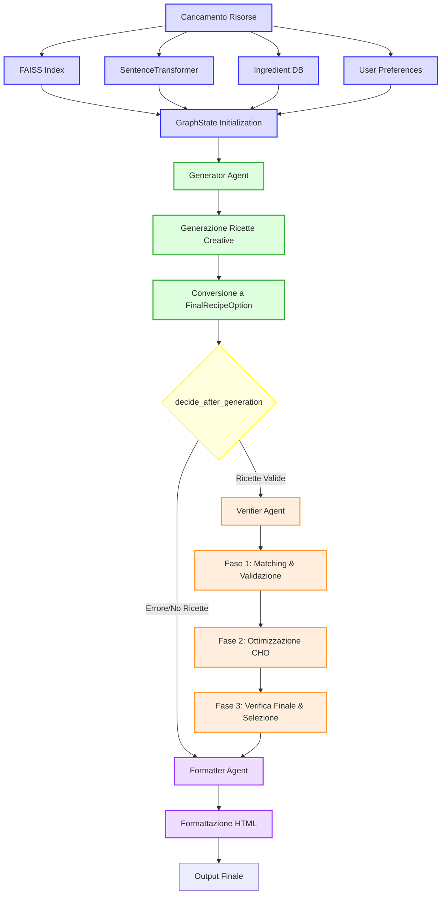

# Workflow LangGraph per Generazione Ricette

```mermaid
flowchart TD
    %% Inizializzazione
    A[Caricamento Risorse] --> B[FAISS Index]
    A --> C[SentenceTransformer]
    A --> D[Ingredient DB]
    A --> E[User Preferences]
    B --> F[GraphState Initialization]
    C --> F
    D --> F
    E --> F
    
    %% Generator Agent
    F --> G[Generator Agent]
    G --> H[Generazione Ricette Creative]
    H --> I[Conversione a FinalRecipeOption]
    I --> K{decide_after_generation}
    
    %% Routing Decision
    K -->|Ricette Valide| L[Verifier Agent]
    K -->|Errore/No Ricette| X[Formatter Agent]
    
    %% Verifier Agent
    L --> M[Fase 1: Matching & Validazione]
    M --> O[Fase 2: Ottimizzazione CHO]
    O --> T[Fase 3: Verifica Finale & Selezione]
    T --> X
    
    %% Formatter Agent
    X --> Y[Formattazione HTML]
    Y --> Z[Output Finale]
    
    %% Stili
    classDef blue fill:#ddf,stroke:#33f,stroke-width:2px
    classDef green fill:#dfd,stroke:#3a3,stroke-width:2px
    classDef orange fill:#fed,stroke:#f93,stroke-width:2px
    classDef yellow fill:#ffd,stroke:#ff3,stroke-width:2px
    classDef purple fill:#edf,stroke:#93f,stroke-width:2px
    
    class A,B,C,D,E,F blue
    class G,H,I green
    class K yellow
    class L,M,O,T orange
    class X,Y purple
    class Z gray
```